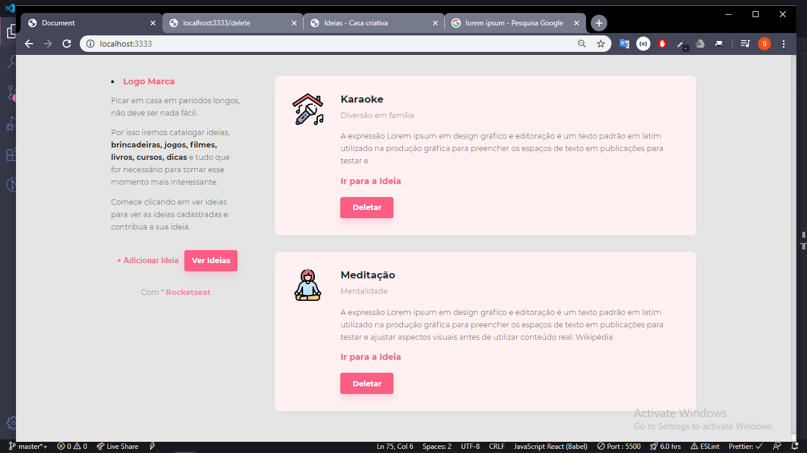
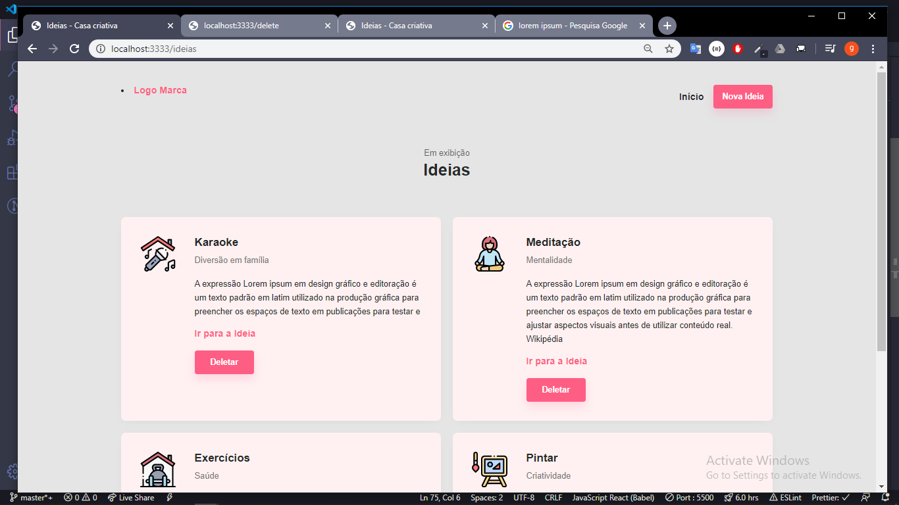
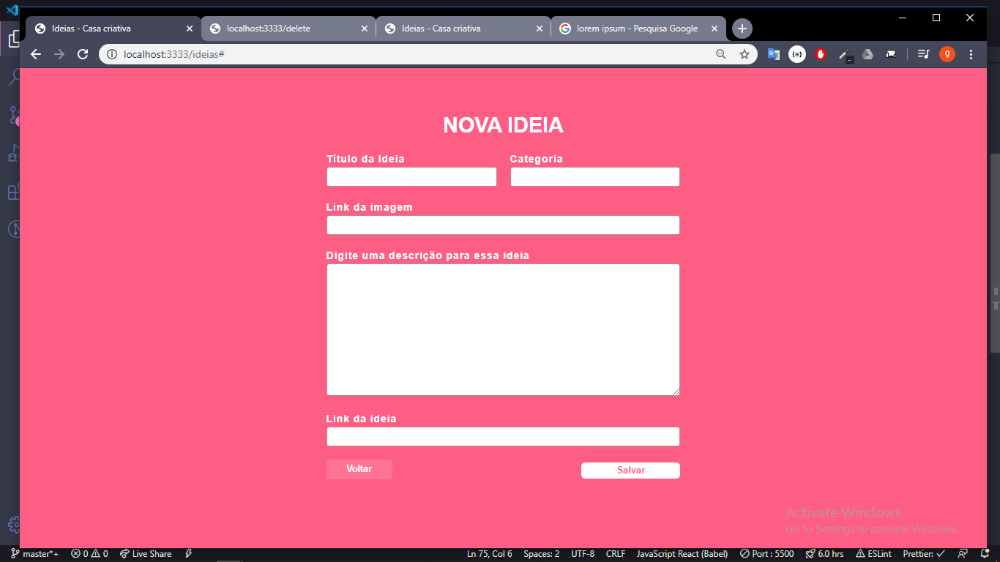
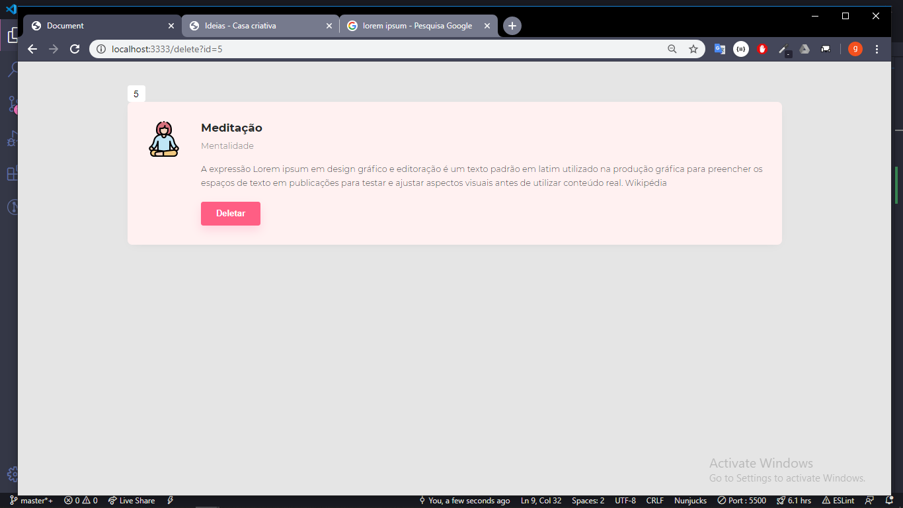
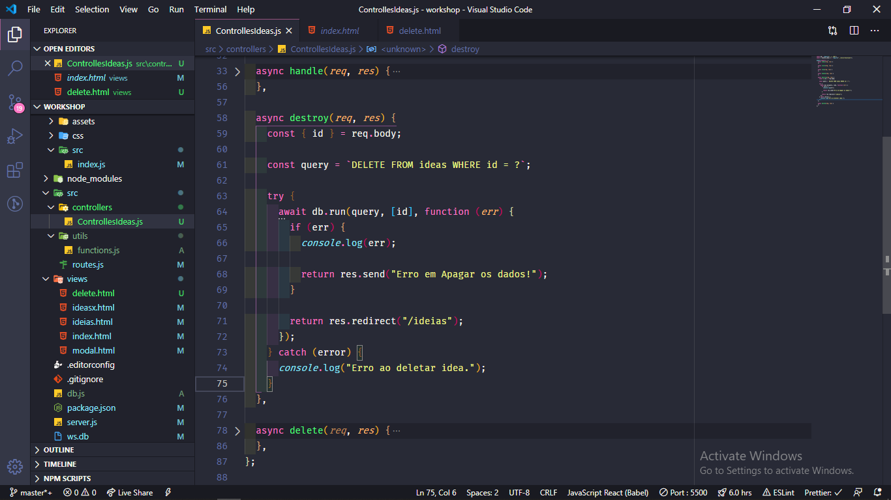

# Whorkshop iniciante

> Projeto para iniciante com Server e Views. (adiconado função de excluir)

## Techs

- [x] Javascript

| Biblioteca/Framework | Descrição             |
| -------------------- | --------------------- |
| NodeJS               | Rodar o ambiente      |
| Express              | Usar como server http |
| SQLite3              | Banco de dados        |
| nunjucks             | engeni de html + JS   |
| HTML5                | linguagem de marcação |
| CSS3                 | Linguagem de estilos  |

---

- **/Home**
  

- **/Ideais**
  

- **/New**
  

- **/delete**
  

- **Editor**
  

[Copyright](https://rocketseat.com.br)
[Student: **elias alexandre**](https://github.com/eliasallex)
